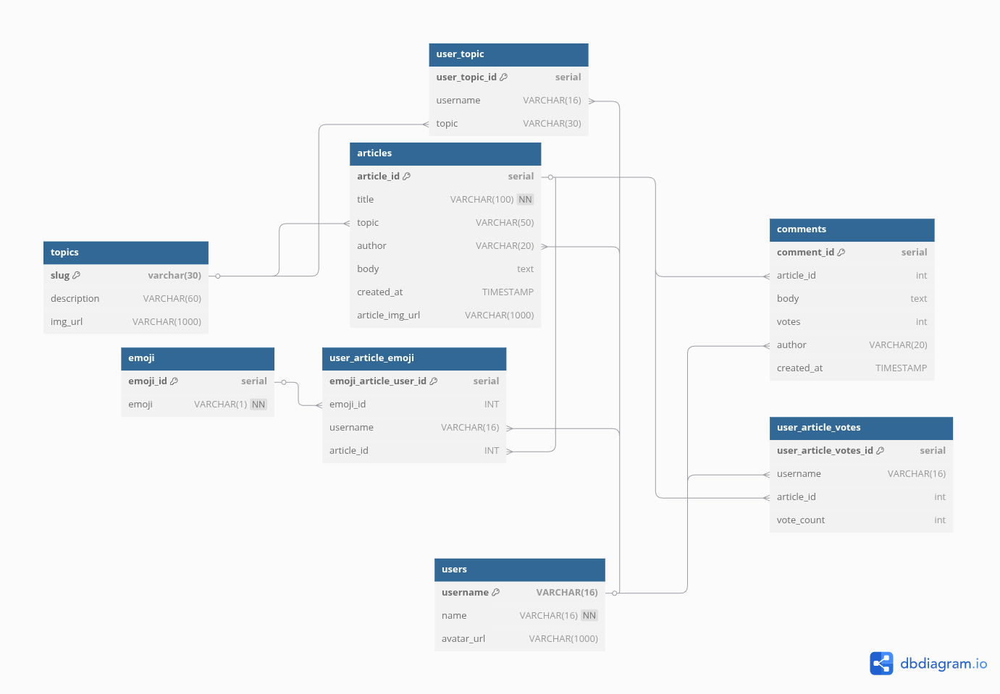

# NC News Seeding

# Setting up development Environment:

- in the root directory of this repo, create a file named .env.development
- within this file, add

PGDATABASE=nc_news

# Setting up test Environment

- in the root directory of this repo, create a file named .env.test
- within this file, add

PGDATABASE=nc_news_test

# Setting up and seeding the database after defining our environments

1. make sure you have all dependencies installed ('npm install' in terminal)
2. 'npm run setup-dbs' to set up the dev and test environment databases
3. 'npm run test-seed' to run tests (and confirm you are connected to the database in a test environment)
4. 'npm run seed-dev' to seed your development database

# Entity Relationship Diagram

# Portfolio considerations

- I wouldn't include PGDATABASE information within the readme typically, but as a portfolio piece I am choosing to so it can be tested
- I chose to use older express methods for error handling to show understanding of them as I am aware that most express databases are built on express v4 or lower
