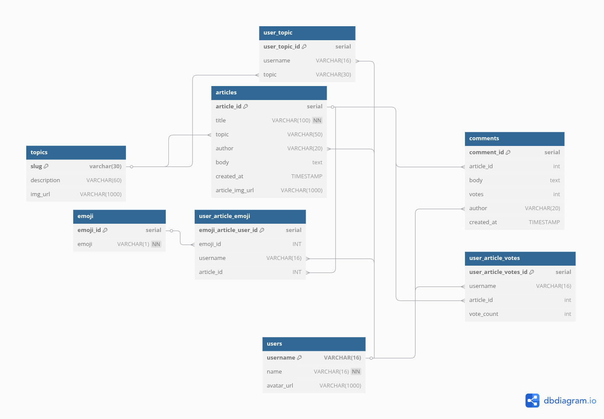

# 📰 NC News - Seeding & API Setup

## 📄 Summary

This repo is a node-powered, MVC-style REST API that serves as the backend for a reddit-like social news application. It will create the databases and seed starter data for the core functionality that the API provides (see endpoints.json or GET /api)

## ⚙️ Installation/Development

1. **Clone this repo**

2. **Install dependencies**

> npm install

3. **Within the root directory of your cloned repository, create the following files**

development environment

> .env.development

test environment

> .env.test

within those files, add the following database variables

.env.development

> PGDATABASE=nc_news

.env.test

> PGDATABASE=nc_news_test

4. **Database setup**

> npm run setup-dbs

5. **Seed local server**

> npm run seed-dev

6. **Start local server**

> npm start

7. **Run tests**

> npm test

## Live Demo & API Spec

Access online and view the available endpoints at https://nc-news-3uk2.onrender.com/api

(Note: the hosting service puts the website to sleep if it hasn't been accessed within the last 15 minutes - this is not a quirk of the repo itself)

## 🧩 Entity Relationship Diagram

## 🎓 Portfolio considerations

- I wouldn't include PGDATABASE information within the readme typically, but as a portfolio piece I am choosing to do so for showcasing purposes

- I chose to use older express methods for error handling to show understanding of them as I am aware that most express databases aren't built on express v5
